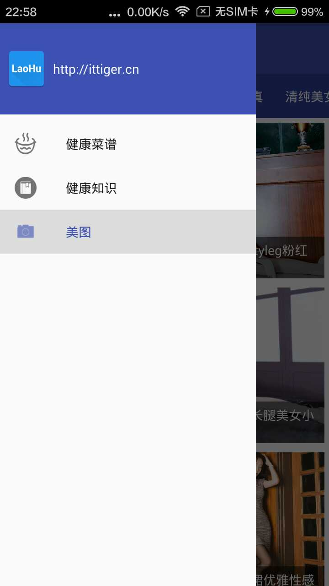
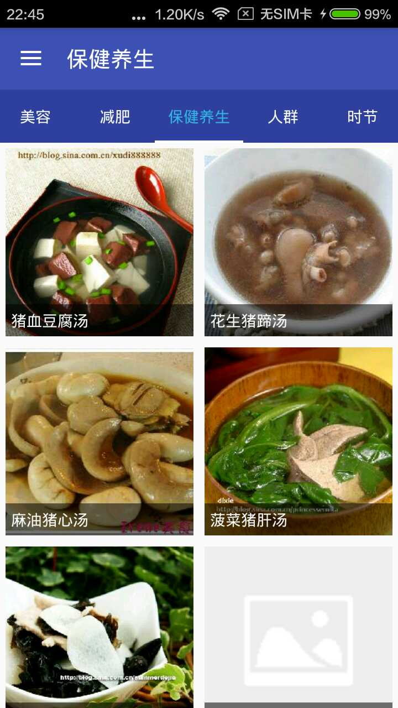
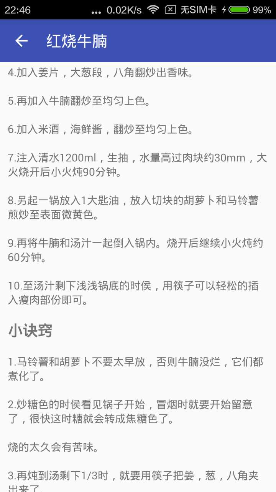

#TigerTnGou

这是我基于[天狗云](http://www.tngou.net/)数据完成的一个App，主要包含了三部分功能：  
1. 美图，大量美女照片哦~~~  
2. 菜谱，各种健康美食的菜谱~~~  
3. 健康知识，介绍各种关于人身体健康方面的知识  

主要采用如下技术点完成该APP
1. [TigerDB](https://github.com/huyongli/TigerDB)，我自己封装的的一个SQLite操作库  
2. [LiteAsync](https://github.com/litesuits/android-lite-async)，顶顶大名的马天宇的线程调度库，非常好用  
3. Retrofit2  
4. RecyclerView  
5. UIL  
6. DrawLayout  
7. NavigationView  

应用截图如下：  

 

  

